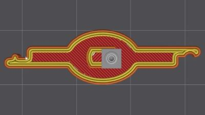
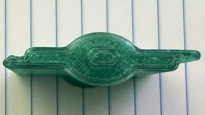
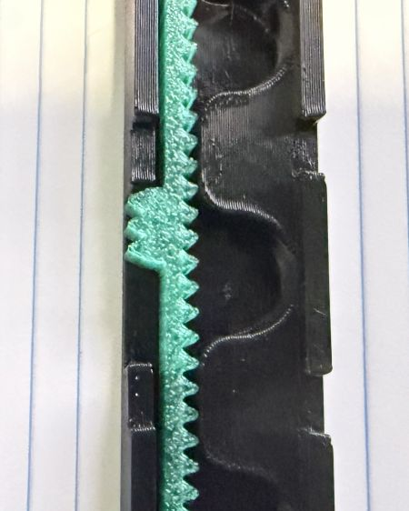
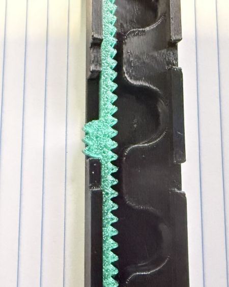
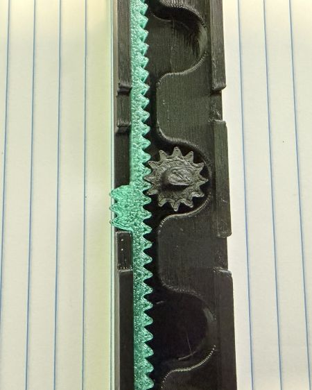
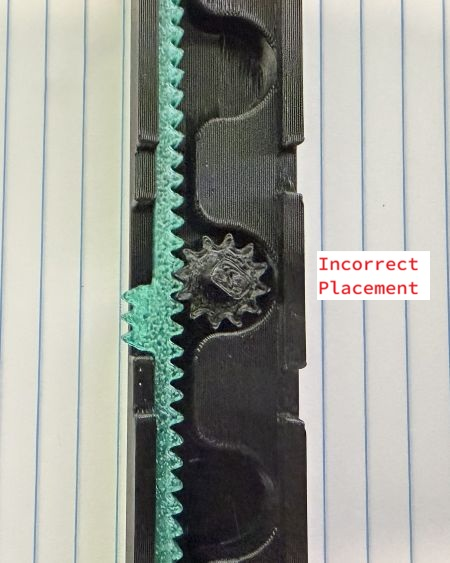
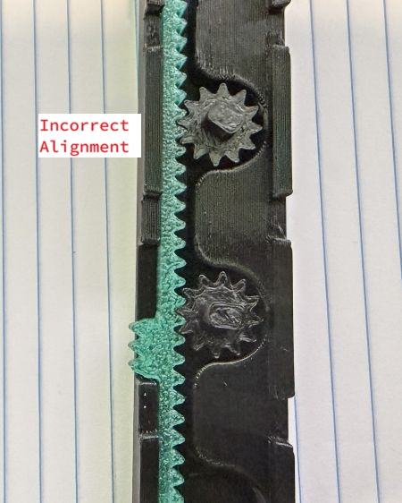

# Louver Lid Riser

Another lid riser? Yes. But now with louvers that make the riser into a fun fidget toy you can play with while staring at your printer and wondering where it all went wrong. It also provides amble height for a modified extruder like the DXC-K2 and better heat control than some of the other options when you actual need to keep the chamber temp high.

Is this the simplest possible design, no. Is it print in place, also no. Is it actually any better at holding heat in? Still testing that. But it was fun to print and assemble. It has gears. It makes a fun sound when you open and close it. So here it is. I hope you enjoy it.

Currently, there is only a K2 Plus version of this (... because I only have a K2 Plus). If other K series printer owners can share a few measurements (see Other Printers below) I can add more printer variants. The entire model is based on the math, so I can drop in any size and produce a similar model for that machine without too much effort. (This model will also be on my GitHub page soon too if you want to modify the OpenSCAD directly.)

## Printing

### Filament

The 3MF file is configured for Hyper PETG, but you can print this model in any filament you prefer. Here are some considerations.

If you are printing primarily PLA and/or PETG then the louvers are likely to be open most of the time. Heat from the bed is unlikely to saturate the print to any degree and you can print this in PLA if you choose (unless your printer is sitting in direct sunlight or some other unique heat issue).

If you plan to use dampers in the closed position for extended printing, please be mindful of the heat deflection and softening temperatures of the filament you use. If your bed is running at 120 and the chamber heater is on full, your printer is trying to keep the average at 65°C but it will be hotter at the top around the riser. Generally speaking, PLA is the weakest in this regard. Many PETG filaments and almost all ABS or ASA variants would provide more than enough protection.

The concern is not that the entire print will melt into a puddle, but that the subtle deformations will leave the louvers unable to open or close as smoothly as desired.

(The filament used in my photos was Numakers Pitch Black PETG and Emerald Wave Transparent PETG. The Emerald Wave is a very nice color. I have no idea why my settings on the black are so off... Issue for another day.)

### Preparation

This print does require tolerances to be fairly close to the model. Ensure your filament is dry and is flow rate is correct. This will ensure the gears and racks will all fit together and operate as expected.

### Model Selection

There are three options for adjusting the louvers included in the file. One is a simple wedge, or tab, that you can slide. Another is a ribbed tab that is flush to the riser. The third is nothing, you would just adjust one louver directly and the rest will follow. All three types are included. Select one style and disable or delete the other two. If you choose the blank style, there is also an alternate version of the bottom style that does not include the cutout.

Print one copy of Plate 1, one copy of Plate 2, and then depending on your choice, two copies of the corresponding option plate (plates 3-5).

### Settings

There are few deliberate settings in the 3MF that you will want to preserve as you configure the file for your filament and printer.

#### Defaults

The following are the defaults for all objects.

Wall Generator: Arachne 
Walls Print Order: Inner/Outer/Inner
Walls: 3
Infill Density: 10
Infill Pattern: Gyroid
Brim Type: No-brim

#### Stiles & Racks

For all of the long diagonal pieces, they are already rotated 45, so we do not want the infill patterns to rotate.

Sparse infill direction: 0
Solid infill direction: 0

For just the upper stiles (the four diagonal pieces on the first plate) we need to do a little bit denser. If you are printing in a material that is already fairly rigid (PLA or ABS/ASA) then you may be able to skip these. They help for PETG which is more flexible.

Walls: 4
Infill Density: 25%

# Assembly

## Naming

Where louvers overlap, one side has a hump and the other a corresponding divet. The side with the bump is "postive" and the side with the divet is the "negative".

Parts are all labeled in the 3MF file so if you need a visual guide, compare to those references.

## Inspect

Before starting, give all the pieces a good look.  Ensure any strings or zits on any pieces are cleaned off. Ensure the parts are intact, particularly the gear teeth. If anything did not come out clean, reprint them before continuing.

### Bottom Stiles

The large pieces that printed on their corners are the bottom stiles. Assembly starts with these parts. Repeat these steps for the two front and two side pieces.

1. Hold the stile with the cutout for the rack to your left. Place the rack into the channel with the gear teeth pointing right.  
2. Slide the rack as far towards you as possible while keeping the slider in the cutout.  

> [!NOTE]
> If you printed the blank variant, you'll wnat to position the rack so that the top end of the rack is at the edge of the top gear opening.

3. Hold the rack in position. Insert a gear into each of the gear slots. The peg on top of the geat should be close to perpendicular with the rack.
	- Good  
	- Bad  
4. Ensure all the gears are aligned the same. The gears can be off perpendicular by one tooth either way, but if so, they should all be off the same amount. If one is angled up and another is a little angled down, it will not work.
	- Bad  
5. Once you have placed all the gears into the stile, carefully slide the rack back and forth. You may experience some grinding, but it should flow smoothly after moving it back and forth a few times. If not, look for what might be preventing the motion such as a uncleared zits or an imperfection in the printed gear teeth.

> [!NOTE]
> Resolve any issues before moving forward. If it doesn't work now, its not going to work later.

6. Take the corresponding stile lid and carefully place it over the top of the stile. The gear pegs should line up with the holes on the lid. Once it is seated over the pegs, press down to lock the dovetails into place. Once complete, the top of the stile should align cleanly.
7. Slide the rack back and forth a few times to ensure nothing from the lid is impacting the gears or the rack.

### Louvers

Slide the rack so that the pegs are perpendicular to the stile. Take a louver and identify the positive side. Press the louver onto the peg ensuring the positive side is to your left.

Repeat for each of the louvers on the stile. Once complete, slide the rack back and forth to ensure the louvers open and close as expected.

### Corners

> [!NOTE]
> All three components of the corner are identical. There is no variation for left or right, front or back.

1. Take an assembled front bottom stile with its louvers attached and place it so the rack lever is facing out.
2. Take a side bottom stile and align the corners.
3. Slot both stiles into the corner base.
4. Repeat with the other two stiles.
5. Align the two sets to form a rectangle and attach the other two corner bases.

> [!TIP]
> If the stiles are loose then they may have warped when printing or cooling. If the rack and gears still operate smoothly and the bottom stile lid sits flush, then you can continue.
> 
> To correct the looseness, the easiest remedy is to print a small shim you can use to fill the gap so you don't waste the part you've printed. This happened to me twice because of the edges did not get as much heat in the printer and shrunk a little.
> 
> Add a plate to the model in the slicer, and then Add Testing Primitive -> Cube. Select the Cube and open the Scale tool. Uncheck "Uniform scale". Change the size to X: 12 Y: 6 Z: 0.6.  Adjust the Z value to the difference between the printed size of the stile and the printed size of the corner cutout it goes into.  Alternatively, just print a couple different heights and see which one works. You can wedge it in with a fingernail or a bed scraper like a real shim, or actually glue it to the end of the stile.

### Padding Panels

Because of how the math shakes out there will be gaps on either side of the louvers and the corners. Along with the louvers, some fixed panels were also printed. Align the positive or negative of the louver with the corresponding positive or negative padding panel. Slide the panel into the slot on the corner and ensure it aligns with the louver when closed. Note, there are different sized panels for the the front and the sides.

### Upper Stiles and Links

Once the corners are in place and the padding panels are installed, place the upper stiles over the louvers. The holes in the upper stiles should align with the pegs of the louvers. The ridge on the upper stiles goes towards the outside of the rectangle.

With the upper stiles in place, place the corner links. These are the parts that look like puzzle pieces. Align the cutout corner and the dovetail with the corner base. Connect the upper stiles to the link. Ensure the upper stiles and the link are all flush.

### Corner Cover

Take the corner cover and align the dovetail with the corresponding channel running through the corner link and base. Slide the cover down ensuring the dovetail remains vertical in the channel. The corner should seat firmly. The bottom of the cover should be flush to the printer case. There should not be a gap between the top of the link and inside top of the cover. The top of the cover should be flush with the top of the ridge on the upper stiles.

Operate all the louvers and ensure they are operating smoothly. If not, reveiw all the connections points between the corners, stiles (top and bottom), and the links. Everything should be flush and connected. Anything twisted or not angled correctly will add binding friction to the louvers. 

### Place the Glass Lid

Place the lid from the printer on top of the riser. It should fit snug at the corners and be flush at the top with the corner cover and upper stile ridge.

Give a few final test swipes of each rack once fully assembled. You want to feel some slight resistance as it holds the louvers in place during printing, but the gears should not be binding and you should not need to exert any measurable force for the louvers to rotate. If it is not moving smoothly, look for any warping on the upper stiles. You can try twisting the upper stile slightly where it connects with the link to alleviate this.

### It Doesn't Fit

If its assembled and working, but does not actually fit in the space for a lid on your printer, please review the measurements in the Other Printers section below and see if yours are different. If they are, please let me know and I can add any variants to the list. At this time, I believe all the K2 Plus units are still using the same lid.

# Other Printers

This model is currently sized for the K2 Plus. If you have another K series printer, or another printer with a similar lid, I would love to include it here. If you can take the following measurements from your printer, I can add it to the list.

* Lid Lip - Measure the distance of the ledge the lid sits on
* Lid Width - Measure the distance across the lid from side to side
* Lid Depth - Measure the distance across the lid from front to back
* Lid Height - Measure the thickness of the lid
* Lid Corner Radius - Measure the corner radius of the lid

If you have the tools for it, or you've done it before for your own modeling, measuring the radius may not be an issue. If that's not your situation, no worries, here's an easy trick. You just need to measure the distance from where the curve ends on one side to where it ends on the other side. This is the diameter of the corner. Align the end (the 0) with the end of the curve on one side, rotate the ruler so it aligns to the end of the curve on the other side. Divide by 2 to get the radius.

# Supported Printers

| Printer Model | Lid Lip | Lid Width | Lid Depth | Lid Height | Lid Corner Radius |
| ------------- | ------- | --------- | --------- | ---------- | ----------------- |
| K2 Plus       | 15      | 404       | 428       | 3          | 5                 |

# License

Louver Lid Riser © 2026 by Morgan Conner is licensed under CC BY-NC-SA 4.0. To view a copy of this license, visit https://creativecommons.org/licenses/by-nc-sa/4.0/ 